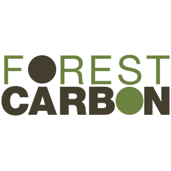

# Forest Carbon Mapping in Canada

The **Forest Carbon Mapping** is an initiative aimed at accurately estimating and mapping carbon stocks within Canada forests. This README provides an overview of the project, its objectives, features, usage instructions, and contribution guidelines.

## Table of Contents

- [Introduction](#introduction)
- [Objectives](#objectives)
- [Features](#features)
- [Installation_and_Usage](#installation and usage)
- [Contributing](#contributing)

## Introduction

The Paris Climate Agreement mandates achieving carbon neutrality by 2100 through the reduction of fossil fuel emissions and achieving a balance between emission sources and carbon sinks. Forests play a vital role in mitigating climate change by acting as significant carbon sinks. Accurately quantifying carbon stocks in forests is essential for informed decision-making in forest management and climate policy. However, carbon monitoring of forests poses unique challenges due to the heterogeneity of carbon stocks within different vegetation components and the limited accessibility of remote or rugged forest areas. Furthermore, the measurement of carbon stocks often involves labor-intensive field campaigns, which are time-consuming and expensive, making it impractical to achieve comprehensive coverage at a large scale. The integration of remote sensing data and machine learning techniques offers a potential solution to overcome these difficulties by leveraging the extensive spatial coverage and automated analysis capabilities, enabling more efficient and accurate estimation of carbon stocks in forests.

## Objectives

- Develop a robust algorithm for estimating carbon stocks based on remote sensing data and ground measurements.
- Generate high-resolution carbon maps for targeted forested regions.

## Features

- **Data Import** Easily import and use geospatial data from various sources, including satellite imagery, LiDAR data, and ground measurements, directly from Google Earth Engine's extensive data catalog.
- **Processing:** Leverage the powerful processing capabilities of TensorFlow to implement advanced algorithms for estimating carbon stocks based on remote sensing data and ground measurements.
- **Visualization:** Create interactive maps and visualizations using Google Earth Engine's mapping tools to display carbon distribution within the selected forested area. Utilize customizable layer styling for better visualization.
- **Export:** Generated carbon stock maps and data can be exported from Google Earth Engine's collaborative environment for further analysis.

## Installation and Usage

1. Clone the repository: `git clone https://github.com/Jerry086/CS6140CarbonMapping.git`
2. Open the notebook 'Forest_Carbon_Mapping.ipynb' by Colab. Alternatively, you can run the notebook locally by installing the [Earth Engine Python API](https://developers.google.com/earth-engine/guides/python_install) and [Jupyter Notebook](https://jupyter.org/install)
3. Install Python libraries if not in Colab environment: `pip install folium`, `pip install pprint`, `pip install tensorflow`
4. Configure Google Cloud Storage: Create a bucket in Google Cloud Storage and set the bucket name in the notebook.
5. Start the development by running all cells.

## Contributing

For questions, comments, or collaborations, contact [wei.zhon@northeastern.edu](wei.zhon@northeastern.edu). We appreciate your interest and involvement!
